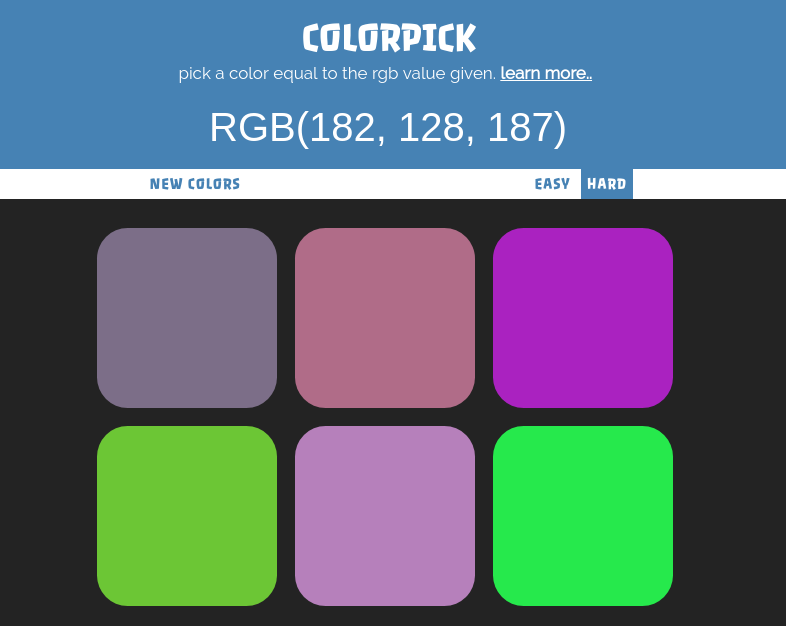
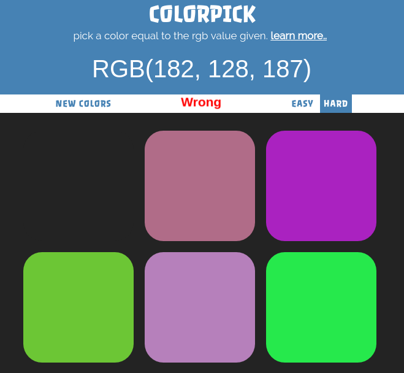
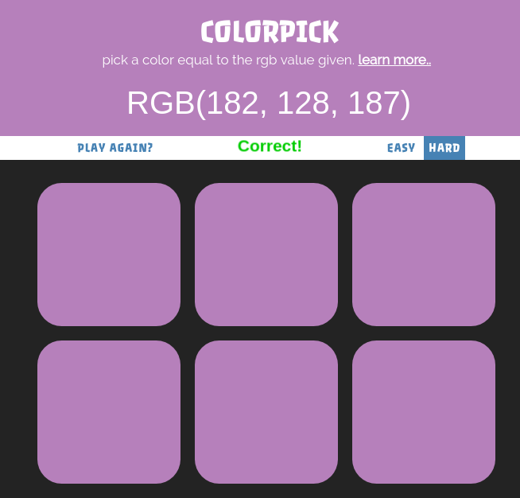
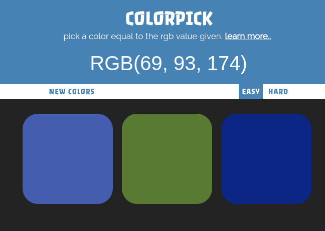

# Color Pick
A simple color guessing game where you try to guess a color based on it's RGB (Red, Green, Blue) value.
Try it out. [Demo](https://samwelkinuthia.github.io/Color-Pick/)

# How to Play

When the page loads, you see an rgb value and 6 color squares. One of the squares has the color displayed in the RGB value.



Lets try our luck by clicking square.

#### oops.. Wrong color



When a wrong color is clicked, the square disappears and a red ugly WRONG is shown.
Clicking wrong squares causes them to disapper but clicking on the right one does something interesting..

#### yaay..We got it right!



All squares reappear and change color to the right color, the title background changes color as well.

# Modes

The default mode is the hard mode with six squares. The easy mode however, reduces the number to three.



Enjoy!! :smile:

# Technologies used
* HTML5
* CSS3
* Javascript
* Animate CSS

# Make It your own!
* Click on the clone/download button on the github page.
* Navigate to the Download path via ``` cd Downloads/Color-Pick```.
* Right click on  ``` index.html ``` and select ```Open in Browser``` .

### Known Bugs
Text overflow issues on Mobile,.. will Update when fixed.

# License
Contents of this repo are bound by the MIT license.

[](http://forthebadge.com)

&copy; 2017
